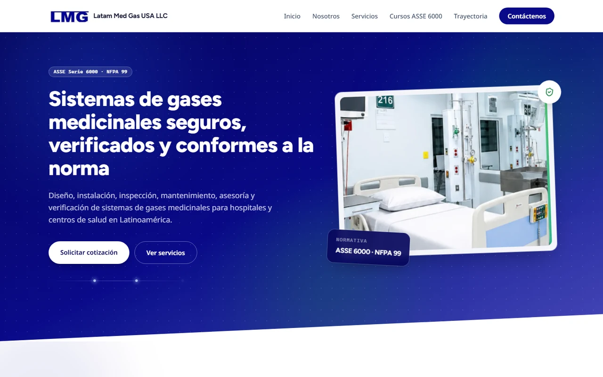

[English](README.md) | **Español**

# Latam Med Gas — Sitio institucional

Sitio de **Latam Med Gas USA LLC**, empresa de Miami que inspecciona, diseña, instala y verifica
sistemas de gases medicinales para hospitales de Latinoamérica, y capacita a su personal hacia la
certificación ASSE 6000.

**En línea en [latammedgas.com](https://latammedgas.com)** desde agosto de 2026 — cliente que
paga, tráfico real, y un dominio que además carga el correo de la empresa. Nada acá es un
prototipo.



## Medido

Lighthouse, perfil móvil, contra producción. Las seis páginas:

|                  | Home | Servicios | Nosotros | Cursos | Trayectoria | Contacto |
| ---------------- | ---- | --------- | -------- | ------ | ----------- | -------- |
| Rendimiento      | 90   | 98        | 96       | 97     | 97          | 97       |
| Accesibilidad    | 100  | 100       | 100      | 100    | 100         | 100      |
| Buenas prácticas | 100  | 100       | 100      | 100    | 100         | 100      |
| SEO              | 100  | 100       | 100      | 100    | 100         | 100      |

**Total Blocking Time 0 ms. Cumulative Layout Shift 0.** LCP 2.1–2.5 s.

Esos números son el resultado de tres arreglos, y los tres eran invisibles porque en los tres
casos el sitio se veía bien:

- Las fotos llegaban al navegador como PNG crudos: `sharp` nunca estuvo instalado, así que el
  servicio de imágenes de Astro las dejaba pasar sin optimizar y sin fallar. Solo el hero pesaba
  1.1 MB.
- Las URL canónicas usaban barra final pero los enlaces internos no, así que cada navegación
  dentro del sitio gastaba un redirect 307 — 1.4 s en móvil — antes de empezar a cargar.
- `/contacto` daba 92 en accesibilidad porque las filas de contacto anidaban `<dt>` y `<dd>` dos
  divs adentro del `<dl>`, lo que rompe el emparejamiento etiqueta/valor para lectores de
  pantalla.

## Decisiones de ingeniería

### El cliente edita sin deploy, y el sitio nunca sale en blanco

Cada sección lee de Sanity en build y cae al contenido semilla de
[`src/lib/content.ts`](src/lib/content.ts) cuando el tipo de documento está vacío. El cliente
edita en `/studio` sobre el sitio desplegado; un webhook dispara el rebuild. Sin CMS que hostear,
sin git, sin fricción de traspaso.

La contrapartida es real y conviene decirla: el contenido vive en dos lugares, y **un documento
poblado en Sanity siempre le gana a la semilla**. Editar solo la semilla no cambia nada en un
sitio vivo cuyo CMS ya está lleno — así fue como un CTA viejo sobrevivió a la reestructura
apuntando a un ancla que ya no existía. Los scripts en [`scripts/`](scripts/) existen justamente
para parchear el dataset cuando eso pasa.

### Imágenes: 1.1 MB → 26 KB

Las fotos semilla locales pasan por `astro:assets`, no por una URL pelada: WebP, srcset de tres
anchos, y recorte al aspecto que la caja CSS realmente muestra — son imágenes verticales en cajas
horizontales, así que `object-cover` descartaba casi la mitad de cada una. Las imágenes de Sanity
siguen usando los derivados de Sanity. El HTML generado no referencia ni un PNG.

### Accesibilidad verificada, no asumida

100 en todas las páginas, alcanzado auditando y corrigiendo, no declarándolo. Menú móvil con
`<button>` real, `aria-expanded` y cierre con Escape (la versión anterior, solo CSS, era
inalcanzable por teclado); enlaces `tel:`/`mailto:`; imágenes dimensionadas; imagen LCP en carga
eager; errores de formulario anunciados por `aria-live`; skip link; y anillos de foco visibles.
El movimiento respeta `prefers-reduced-motion`, y el tilt de las tarjetas filtra por
`pointerType` en cada evento en vez de por media query, porque una laptop táctil con mouse
coincide con `pointer: coarse` y perdería el efecto por completo.

### Privacidad sin banner de cookies

La analítica es Cloudflare Web Analytics, que no pone cookies. El mapa de contacto es un
OpenStreetMap incrustado, que tampoco pone ninguna y está declarado en la política de privacidad;
Google Maps es solo un enlace. Turnstile se carga desde Cloudflare cuando el formulario está en
pantalla. Ningún tercero pone cookies, así que el sitio no tiene banner de consentimiento porque
no hay nada que consentir — no un banner que miente.

### Captura de leads que ni filtra ni sirve de cañón de correo

Los leads viven en una tabla `leads` de Supabase cuya seguridad a nivel de fila no concede
`select`, `update` ni `delete` a nadie público: solo se leen desde el panel de Supabase.

Escribir, en cambio, estaba abierto, y eso pesaba más de lo que parecía. El navegador insertaba
directo en PostgREST con la clave anónima, que es pública por diseño: viaja en el bundle.
Cualquiera podía copiarla y escribir filas — y como cada fila dispara un webhook que manda
correo, **un POST sin autenticar equivalía a un correo** al buzón de trabajo de la empresa. El
daño nunca fueron las filas basura; era inundar ese buzón y quemar la reputación de envío de
`send.latammedgas.com`.

Así que el navegador ya no escribe en la tabla. Envía a
[`submit-lead`](supabase/functions/submit-lead/), que comprueba un token de Cloudflare Turnstile
y solo entonces inserta con el service role. `anon` ya no tiene política de inserción, así que
esa función es la única vía. Los tokens de Turnstile son de un solo uso, el widget se reinicia
antes de cada envío, y la función revalida todos los campos: quien la llame no tiene por qué
haber pasado por nuestro formulario.

Cada inserción dispara un Database Webhook hacia
[`notify-lead`](supabase/functions/notify-lead/), que envía por Resend desde un **subdominio**
verificado (`send.latammedgas.com`): el dominio raíz ya publica un registro SPF para los buzones
de la empresa, y un segundo SPF ahí invalidaría ambos y rompería correo del que depende gente.
Esa función puntúa señales de spam en vez de contar volumen, así que una consulta real que
incluya un enlace se entrega igual, y la fila se guarda en ambos casos — un falso positivo
cuesta un aviso, nunca un lead.

### La escala tipográfica en un solo lugar

Una escala de 9 pasos y una regla de radios documentada viven en
[`src/styles/global.css`](src/styles/global.css). Los componentes usan `text-sm` / `text-2xl`,
nunca píxeles sueltos. Cuando el cuerpo tuvo que pasar de 15 px a 16 px por legibilidad, fueron
cuatro tokens y subió todo el sitio de una.

## Stack

| Capa           | Elección                                                               | Por qué                                                                                                  |
| -------------- | ---------------------------------------------------------------------- | -------------------------------------------------------------------------------------------------------- |
| Framework      | [Astro](https://astro.build), salida estática                          | Cero JS por defecto; solo hidrata lo que necesita interactividad                                         |
| Interactividad | Islas de [React](https://react.dev)                                    | En las páginas públicas, una ([`ContactForm.tsx`](src/components/ContactForm.tsx)); el resto es `.astro` |
| Estilos        | [Tailwind CSS v4](https://tailwindcss.com)                             | Tokens de diseño centralizados en [`global.css`](src/styles/global.css)                                  |
| CMS            | [Sanity](https://sanity.io), Studio embebido en `/studio`              | El cliente edita sobre el sitio desplegado; sin CMS aparte que mantener o pagar                          |
| Backend        | [Supabase](https://supabase.com)                                       | Solo leads de contacto; nada público lee ni escribe la tabla — se escribe vía edge function              |
| Defensa bots   | [Cloudflare Turnstile](https://www.cloudflare.com/products/turnstile/) | Invisible salvo reto; su token es lo que autoriza escribir un lead                                       |
| Hosting        | [Cloudflare Workers](https://workers.cloudflare.com)                   | Capa gratuita, deploy por git push, CDN global                                                           |
| Lenguaje       | TypeScript, estricto                                                   | `astro check` pasa limpio en todo el proyecto                                                            |

## Estructura

```text
.
├── astro.config.mjs           # Astro + React + Tailwind + Sanity; trailingSlash: 'always'
├── sanity.config.ts           # Config del Studio embebido
├── scripts/                   # Migraciones puntuales de Sanity, con `npx sanity exec`
├── src/
│   ├── components/            # Secciones Astro + ContactForm.tsx, la única isla React
│   ├── layouts/Layout.astro   # <head>, fuentes, meta SEO/OG, JSON-LD
│   ├── lib/
│   │   ├── content.ts         # Contenido semilla / respaldo
│   │   ├── sanityQueries.ts   # Consultas GROQ tipadas, en build
│   │   └── leads.ts           # Formulario de contacto → edge function submit-lead
│   ├── pages/                 # index, nosotros, servicios, cursos, trayectoria, contacto, privacidad, 404
│   ├── sanity/schemaTypes/    # Modelo de contenido
│   ├── scripts/site.ts        # Interacciones de cliente; re-ejecuta en astro:page-load
│   └── styles/global.css      # Tokens de diseño, keyframes
└── supabase/
    ├── functions/submit-lead/ # Edge function: Turnstile → inserción (service role)
    ├── functions/notify-lead/ # Edge function: webhook → correo con marca, con filtro de spam
    └── migrations/            # Tabla `leads`, límites de longitud, política y permisos de anon revocados
```

## Arranque

```sh
pnpm install
cp .env.example .env   # Sanity + Supabase, y PUBLIC_TURNSTILE_SITE_KEY o no arranca
pnpm dev               # http://localhost:4321
```

| Variable                    | Dónde obtenerla                                                                                                                                                      |
| --------------------------- | -------------------------------------------------------------------------------------------------------------------------------------------------------------------- |
| `PUBLIC_SANITY_PROJECT_ID`  | [sanity.io/manage](https://sanity.io/manage) → tu proyecto                                                                                                           |
| `PUBLIC_SANITY_DATASET`     | Normalmente `production`                                                                                                                                             |
| `PUBLIC_SUPABASE_URL`       | [supabase.com/dashboard](https://supabase.com/dashboard) → Project Settings → API                                                                                    |
| `PUBLIC_TURNSTILE_SITE_KEY` | Cloudflare → Turnstile → tu widget. Pública, viaja en el bundle. **El build falla sin ella**, a propósito: si falta, el formulario deja de recoger leads en silencio |
| `PUBLIC_CF_BEACON_TOKEN`    | Cloudflare → Web Analytics. Identificador público, no secreto. Dejalo vacío en local para que el tráfico de desarrollo no ensucie los datos                          |

| Comando            | Acción                                               |
| ------------------ | ---------------------------------------------------- |
| `pnpm dev`         | Servidor de desarrollo                               |
| `pnpm build`       | Build estático a `./dist/`                           |
| `pnpm preview`     | Sirve el build de producción                         |
| `pnpm astro check` | Chequeo de tipos                                     |
| `pnpm lint`        | ESLint (JS + TypeScript + Astro)                     |
| `pnpm format`      | Prettier, orden de clases Tailwind, soporte `.astro` |
| `pnpm backup`      | Respalda el dataset de Sanity en `../sanity-backups` |

## Editar contenido

Los editores entran a `/studio` en el sitio desplegado — sin código, sin git, sin instalar nada.
El modelo vive en [`src/sanity/schemaTypes/`](src/sanity/schemaTypes/): ajustes del sitio, hero,
servicios, certificaciones, cursos, proyectos, testimonios.

Una trampa fácil de pisar desde el propio Studio: el respaldo de las colecciones salta solo
cuando el tipo está **completamente vacío** (`courses.length > 0 ? courses : DEFAULT_COURSES`).
Crear un curso en un tipo que no tenía ninguno habría reemplazado diez cursos renderizados por
uno. Hoy todas las colecciones que tienen semilla están pobladas, así que la semilla es un último
recurso real y no una dependencia viva. Los testimonios no tienen semilla: sin ninguno publicado,
esa sección simplemente no aparece.

Una regla para quien escriba scripts contra el dataset: **nunca le pongas un punto al `_id` de un
documento de Sanity.** Sanity los trata como privados y los sirve solo a peticiones autenticadas,
así que la API pública — la que usa el build — no ve nada. Trece proyectos importados quedaron
invisibles un mes por eso, y el respaldo semilla renderizaba los mismos trece, así que nada
parecía roto.

## Despliegue

1. **Cloudflare Workers** — repo conectado; build `pnpm build`, salida `dist`. Push a `master`.
   `wrangler.jsonc` define `not_found_handling: "404-page"`; sin eso, las rutas desconocidas
   devuelven un 404 vacío en vez de la página con estilo.
2. **Variables de entorno** — las mismas claves en la configuración del proyecto en Cloudflare. Si
   falta el token del beacon, el build pasa sin analítica y sin error.
3. **Las dos edge functions necesitan `--no-verify-jwt`**, por motivos distintos.
   `notify-lead` la llama un Database Webhook que no manda cabecera `Authorization`.
   `submit-lead` la llama un navegador que no manda ninguna clave ni cabecera `Authorization`,
   así que el gateway la rechazaría antes de llegar al código. En ambos casos el fallo es un 401 invisible que nunca se manifiesta como un
   formulario roto. Ver [`submit-lead`](supabase/functions/submit-lead/README.md) y
   [`notify-lead`](supabase/functions/notify-lead/README.md).
4. **Las migraciones de Supabase deben nombrarse con marca de tiempo de 14 dígitos.** El CLI
   lista cualquier otro nombre y después lo ignora, y `db push` responde «Remote database is up
   to date» sin haber aplicado nada.
5. **Antes de cada push** — `git fetch` y rebase. El workflow de rebuild de Sanity pushea commits
   vacíos, así que `origin/master` se mueve sin aviso.
6. **Respaldos de contenido** — `pnpm backup` guarda el dataset en `../sanity-backups`, que es
   [un repositorio privado](https://github.com/BryanBel/latam-med-gas-sanity-backups) fuera de
   este, con su propia tarea programada que hace el mismo respaldo a diario. El historial de documentos del plan actual de Sanity es
   corto: el 20 de septiembre de 2026 la transacción más antigua que quedaba de `siteSettings` era
   del día anterior, aunque el documento se creó el 9 de agosto. Conviene correrlo antes de
   cualquier script de migración.

### El despliegue de vista previa

La edición visual —hacer clic en un título de la página y caer en ese campo del Studio— necesita
que el HTML lleve stega: marcadores invisibles dentro de cada texto que dicen qué campo lo
produjo. Esos marcadores no pueden acercarse a producción, porque terminan dentro de la meta
descripción, el JSON-LD y los enlaces `tel:`. Por eso la vista previa es un **segundo Worker de
Cloudflare** construido desde este mismo repositorio, y toda la diferencia son tres variables:

| Variable                       | Valor                                                           |
| ------------------------------ | --------------------------------------------------------------- |
| `PUBLIC_SANITY_PREVIEW`        | `true`                                                          |
| `SANITY_VIEWER_TOKEN`          | un token de Sanity con rol **viewer**, desde sanity.io/manage   |
| `PUBLIC_SANITY_PREVIEW_ORIGIN` | opcional; por defecto, la URL workers.dev del Worker de preview |

Con la bandera puesta, `astro build` pasa a `output: 'server'` y carga el adaptador de
Cloudflare; sin ella el build es idéntico byte a byte al de antes de que todo esto existiera.

Dos cosas que conviene saber antes de tocarlo:

- El adaptador (`^14.3`) solo se carga con `PUBLIC_SANITY_PREVIEW=true`. Desde la 14.3.0 importa
  `renderForPrerender` de `astro/app`, que solo existe desde astro 7.3, así que Astro no puede
  bajar de la 7.3 sin arrastrar al adaptador.
- El Worker de preview es **público**: no está detrás del login de Cloudflare Access que cubre
  latammedgas.com, renderiza borradores y su formulario escribe leads reales.
- `SANITY_VIEWER_TOKEN` se lee al construir y queda dentro del bundle de **servidor** del
  preview. Nunca está en el del cliente, pero sí en un artefacto de build: por eso debe ser un
  token de solo lectura y nunca el que tiene permisos de escritura.
